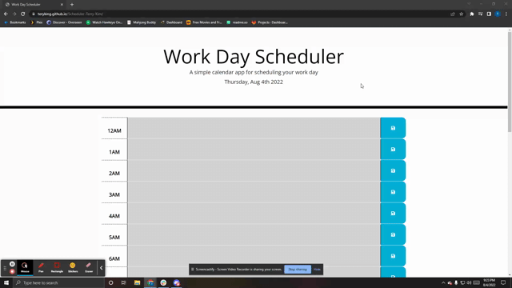

# Scheduler-Terry-Kim
Work Scheduler by Terry Kim

This is a simple work scheduler for day to day basis. This will display the current day and will list
a time frame from midnight all the way to the next day. IE: 12AM to 11PM

-Every hour has its own section for user to input tasks.

-Every hour will be displayed with 3 different color of Gray, Red, and Green.

-The Gray color will represent the time frame that has already passed.

-The Red Color will represent the current time of the time frame.

-The Green Color will represent the upcoming time frame.

-Once the time frame hits the next day, it should automatically reload the next day.

-The input the user put should save onto localstorage and still be displayed upon the text area of the time block.

## Screenshots

Live Website: https://teryking.github.io/Scheduler-Terry-Kim/

## Authors

- [@Terry Kim](https://github.com/TeryKing)

## Acknowledgements

Georgia Tech Coding Bootcamp: https://bootcamp.pe.gatech.edu/coding/

W3Schools: https://www.w3schools.com/

MDN : https://developer.mozilla.org/en-US/
## Feedback

If you have any feedback, please reach out to me at Tery_x3@hotmail.com

